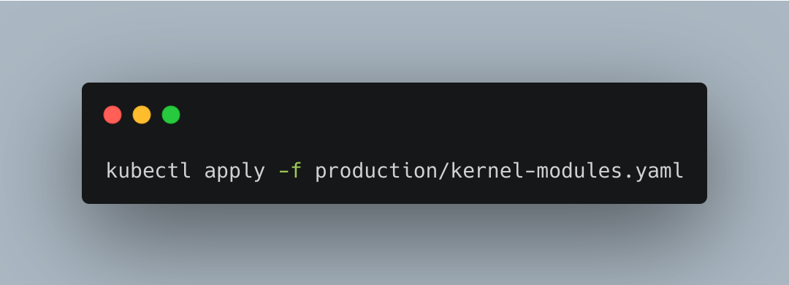

# Ubuntu Operator


```
apiVersion: ubuntu.machinery.io.canonical.com/v1alpha1
kind: UbuntuMachineConfiguration
metadata:
  name: ubuntumachineconfiguration-sample
spec:
  desiredModules:
  - name: "nvme_core"
    flags: ""
  - name: "rfcomm"
    flags: ""
  desiredPackages:
    apt:
    - name: "build-essentials"
    snap:
    - name: "microk8ss"
      confinement: "classic"
```





Control your underlying Ubuntu distribution through Kubernetes....


## Installation

## Host-relay

`make install-relay`

## Operator 
```
make install # Uploads the CustomResourceDefinitions into your cluster
make deploy
```


## Development

### Operator 

After installing the CRD with `make install`
Run `go run main.go` to run the operator locally.


#### Notes

Regenerating the clientset was done from [this](https://www.fatalerrors.org/a/writing-crd-by-mixing-kubeuilder-and-code-generator.html) guide.