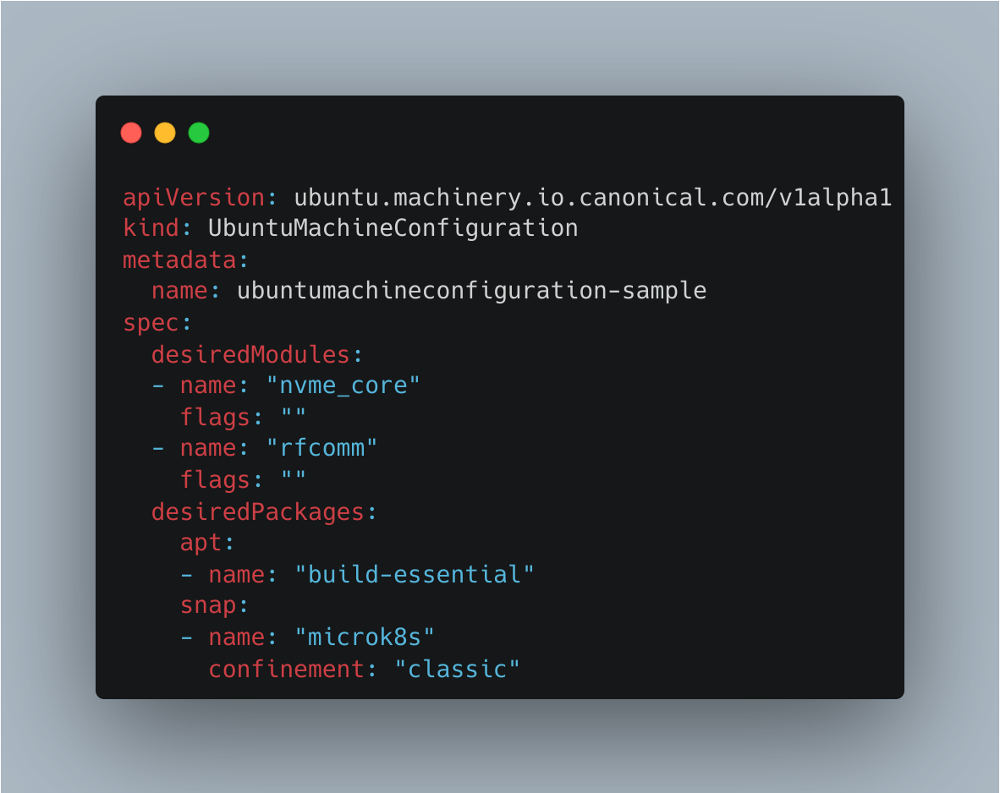
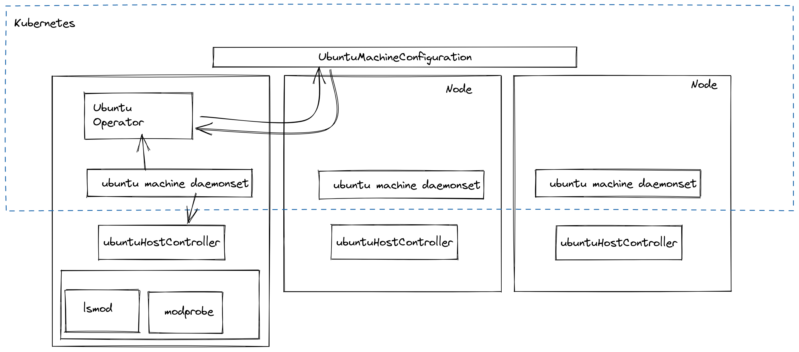

# Ubuntu Operator


Control Ubuntu from Kubernetes.





Control your underlying Ubuntu distribution through Kubernetes....



## Roadmap

- [x] Kernel module support
- [ ] Package system support

## Installation

Two step installation process.
1. Installing the host-relay on all hosts
2. Installing the Operator in cluster once.

### Host-relay

`make install-relay`

### Operator 
```
make install # Uploads the CustomResourceDefinitions into your cluster
make deploy
```


